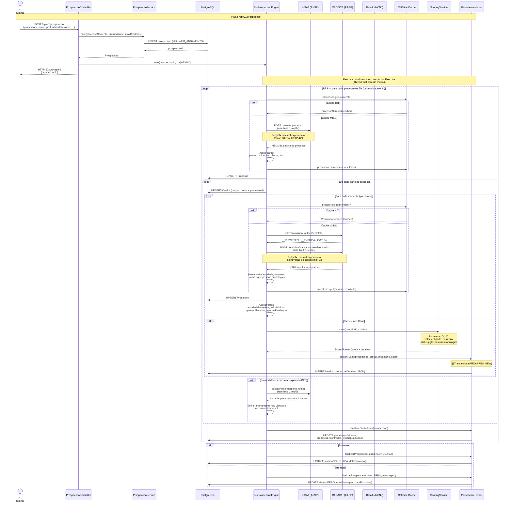

# Prospeccao BFS — Fluxo Completo

Fluxo principal do sistema: inicia uma prospeccao recursiva a partir de um processo-semente, descobre co-credores em profundidade, consulta precatorios, aplica scoring e persiste leads qualificados.

