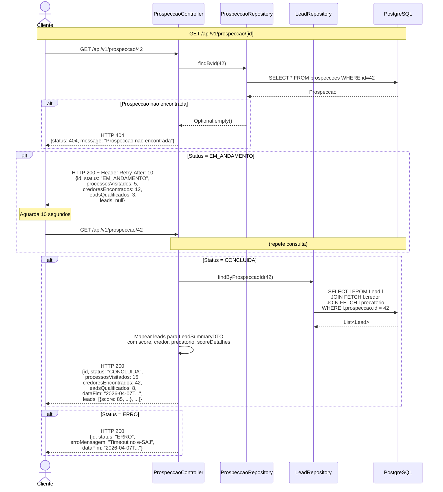

# Polling de Prospeccao — Acompanhamento de Progresso

Fluxo de consulta do status de uma prospeccao em andamento. O cliente faz polling periodico ate a conclusao.

```mermaid
sequenceDiagram
    actor Cliente
    participant Controller as ProspeccaoController
    participant RepoPros as ProspeccaoRepository
    participant RepoLead as LeadRepository
    participant DB as PostgreSQL

    Note over Cliente,DB: GET /api/v1/prospeccao/{id}

    Cliente->>Controller: GET /api/v1/prospeccao/42

    Controller->>RepoPros: findById(42)
    RepoPros->>DB: SELECT * FROM prospeccoes WHERE id=42
    DB-->>RepoPros: Prospeccao

    alt Prospeccao nao encontrada
        RepoPros-->>Controller: Optional.empty()
        Controller-->>Cliente: HTTP 404<br/>{status: 404, message: "Prospeccao nao encontrada"}
    end

    alt Status = EM_ANDAMENTO
        Controller-->>Cliente: HTTP 200 + Header Retry-After: 10<br/>{id, status: "EM_ANDAMENTO",<br/>processosVisitados: 5,<br/>credoresEncontrados: 12,<br/>leadsQualificados: 3,<br/>leads: null}

        Note over Cliente: Aguarda 10 segundos

        Cliente->>Controller: GET /api/v1/prospeccao/42
        Note over Controller,DB: (repete consulta)
    end

    alt Status = CONCLUIDA
        Controller->>RepoLead: findByProspeccaoId(42)
        RepoLead->>DB: SELECT l FROM Lead l<br/>JOIN FETCH l.credor<br/>JOIN FETCH l.precatorio<br/>WHERE l.prospeccao.id = 42
        DB-->>RepoLead: List<Lead>

        Controller->>Controller: Mapear leads para LeadSummaryDTO<br/>com score, credor, precatorio, scoreDetalhes

        Controller-->>Cliente: HTTP 200<br/>{id, status: "CONCLUIDA",<br/>processosVisitados: 15,<br/>credoresEncontrados: 42,<br/>leadsQualificados: 8,<br/>dataFim: "2026-04-07T...",<br/>leads: [{score: 85, ...}, ...]}
    end

    alt Status = ERRO
        Controller-->>Cliente: HTTP 200<br/>{id, status: "ERRO",<br/>erroMensagem: "Timeout no e-SAJ",<br/>dataFim: "2026-04-07T..."}
    end
```
