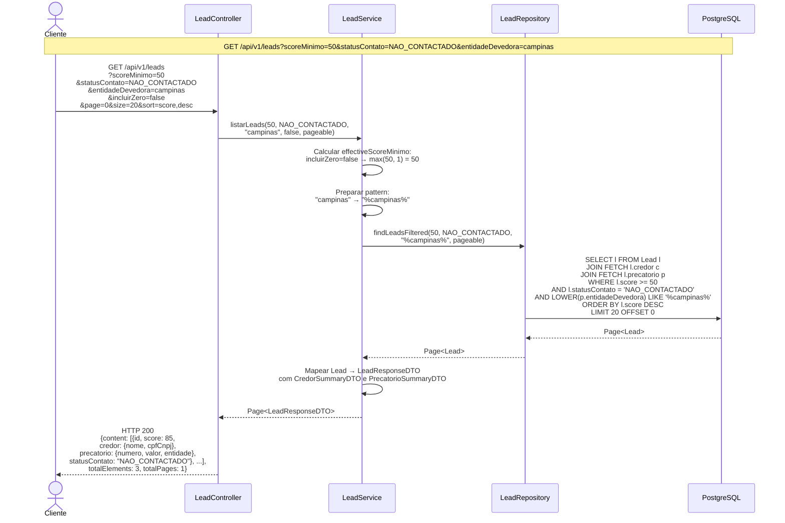
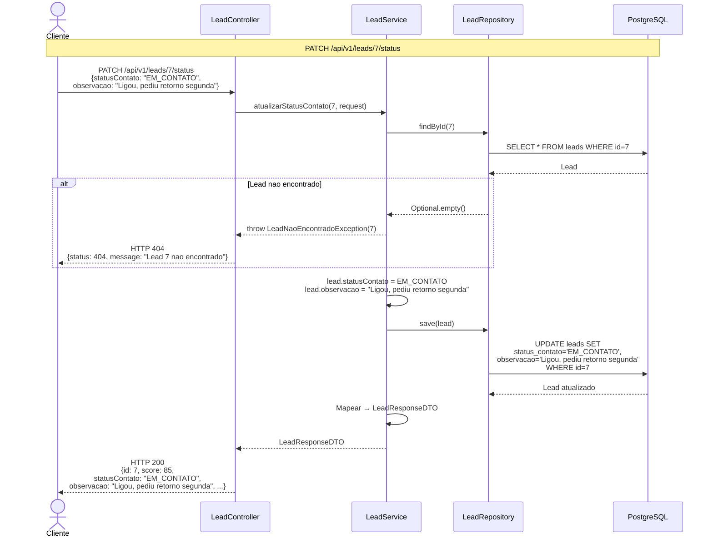

# Gestao de Leads — Listagem e Atualizacao de Status

Fluxos de consulta paginada de leads com filtros e atualizacao de status de contato.

## Listagem com Filtros

## Atualizacao de Status de Contato

