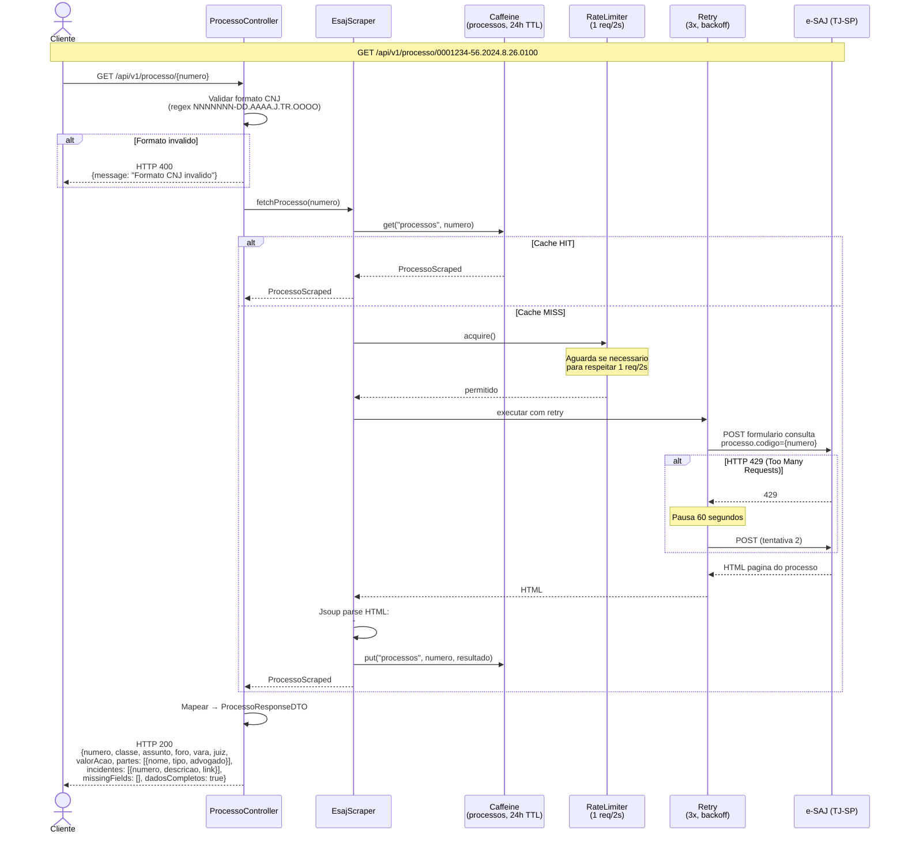
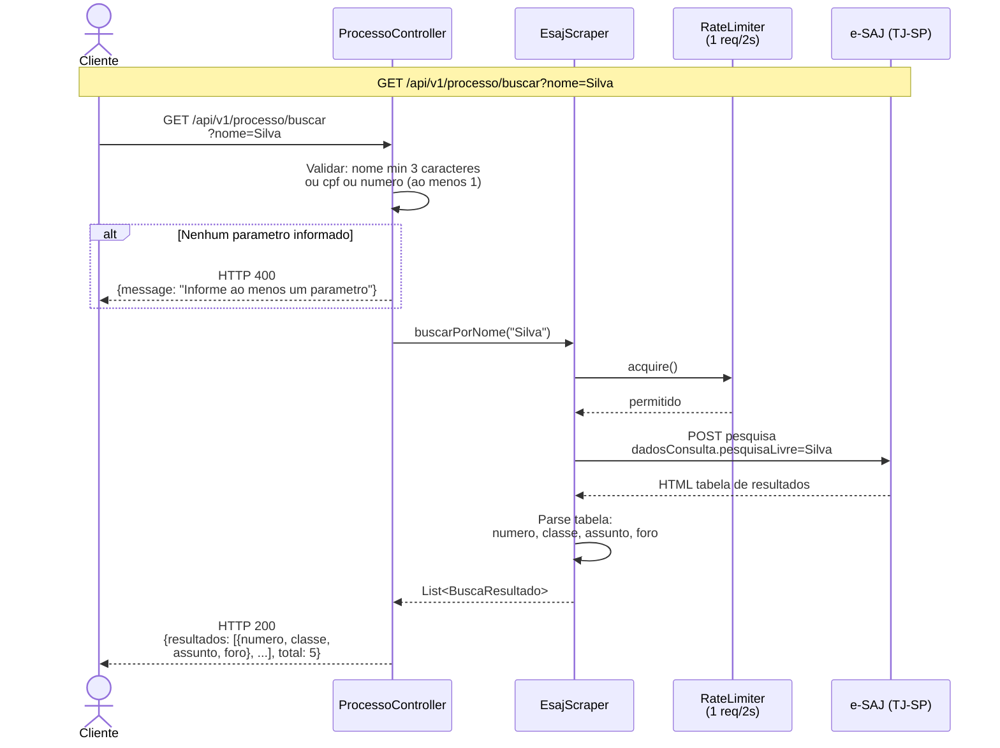

# Consulta de Processo — e-SAJ

Fluxos de consulta direta ao portal e-SAJ do TJ-SP: busca por numero CNJ e pesquisa por nome/CPF.

## Consulta por Numero

```mermaid
sequenceDiagram
    actor Cliente
    participant Controller as ProcessoController
    participant Scraper as EsajScraper
    participant Cache as Caffeine<br/>(processos, 24h TTL)
    participant RateLimit as RateLimiter<br/>(1 req/2s)
    participant Retry as Retry<br/>(3x, backoff)
    participant ESAJ as e-SAJ (TJ-SP)

    Note over Cliente,ESAJ: GET /api/v1/processo/0001234-56.2024.8.26.0100

    Cliente->>Controller: GET /api/v1/processo/{numero}

    Controller->>Controller: Validar formato CNJ<br/>(regex NNNNNNN-DD.AAAA.J.TR.OOOO)

    alt Formato invalido
        Controller-->>Cliente: HTTP 400<br/>{message: "Formato CNJ invalido"}
    end

    Controller->>Scraper: fetchProcesso(numero)

    Scraper->>Cache: get("processos", numero)

    alt Cache HIT
        Cache-->>Scraper: ProcessoScraped
        Scraper-->>Controller: ProcessoScraped
    else Cache MISS
        Scraper->>RateLimit: acquire()
        Note over RateLimit: Aguarda se necessario<br/>para respeitar 1 req/2s
        RateLimit-->>Scraper: permitido

        Scraper->>Retry: executar com retry
        Retry->>ESAJ: POST formulario consulta<br/>processo.codigo={numero}

        alt HTTP 429 (Too Many Requests)
            ESAJ-->>Retry: 429
            Note over Retry: Pausa 60 segundos
            Retry->>ESAJ: POST (tentativa 2)
        end

        ESAJ-->>Retry: HTML pagina do processo
        Retry-->>Scraper: HTML

        Scraper->>Scraper: Jsoup parse HTML:<br/>- #tablePartesPrincipais → partes<br/>- #incidentes → incidentes<br/>- classe, assunto, foro, vara, juiz<br/>- valorAcao<br/>- missingFields (campos nulos)

        Scraper->>Cache: put("processos", numero, resultado)

        Scraper-->>Controller: ProcessoScraped
    end

    Controller->>Controller: Mapear → ProcessoResponseDTO

    Controller-->>Cliente: HTTP 200<br/>{numero, classe, assunto, foro, vara, juiz,<br/>valorAcao, partes: [{nome, tipo, advogado}],<br/>incidentes: [{numero, descricao, link}],<br/>missingFields: [], dadosCompletos: true}
```

## Pesquisa por Nome/CPF

```mermaid
sequenceDiagram
    actor Cliente
    participant Controller as ProcessoController
    participant Scraper as EsajScraper
    participant RateLimit as RateLimiter<br/>(1 req/2s)
    participant ESAJ as e-SAJ (TJ-SP)

    Note over Cliente,ESAJ: GET /api/v1/processo/buscar?nome=Silva

    Cliente->>Controller: GET /api/v1/processo/buscar<br/>?nome=Silva

    Controller->>Controller: Validar: nome min 3 caracteres<br/>ou cpf ou numero (ao menos 1)

    alt Nenhum parametro informado
        Controller-->>Cliente: HTTP 400<br/>{message: "Informe ao menos um parametro"}
    end

    Controller->>Scraper: buscarPorNome("Silva")

    Scraper->>RateLimit: acquire()
    RateLimit-->>Scraper: permitido

    Scraper->>ESAJ: POST pesquisa<br/>dadosConsulta.pesquisaLivre=Silva
    ESAJ-->>Scraper: HTML tabela de resultados

    Scraper->>Scraper: Parse tabela:<br/>numero, classe, assunto, foro

    Scraper-->>Controller: List<BuscaResultado>

    Controller-->>Cliente: HTTP 200<br/>{resultados: [{numero, classe,<br/>assunto, foro}, ...], total: 5}
```
