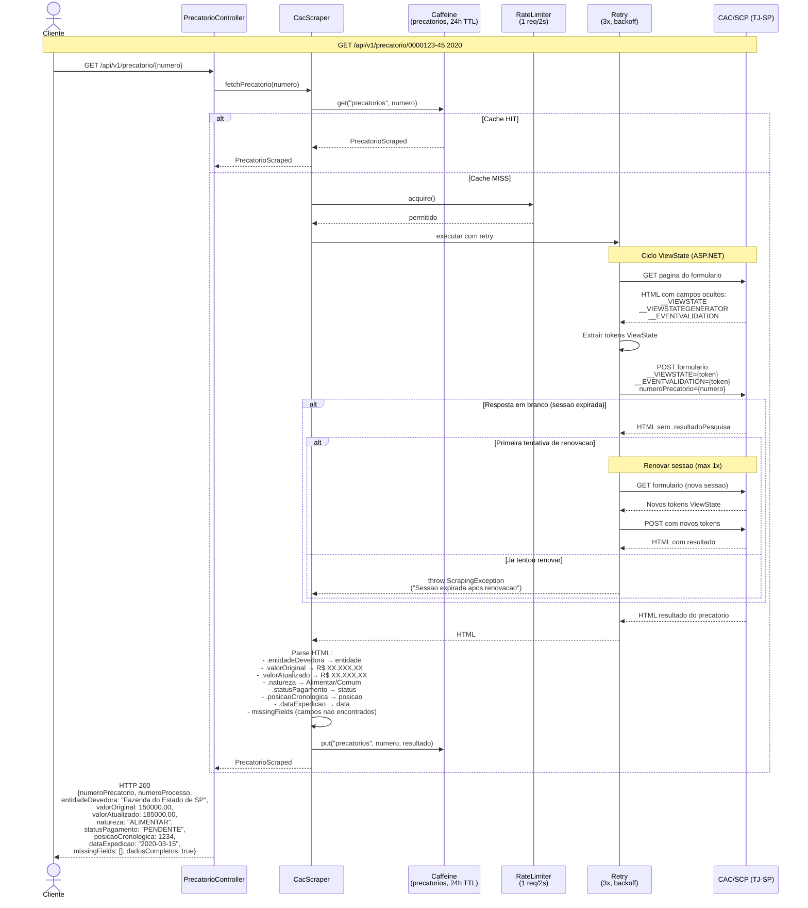

# Consulta de Precatorio — CAC/SCP

Fluxo de consulta ao portal CAC/SCP do TJ-SP para obter dados detalhados de um precatorio. Requer ciclo de ViewState (ASP.NET).

```mermaid
sequenceDiagram
    actor Cliente
    participant Controller as PrecatorioController
    participant Scraper as CacScraper
    participant Cache as Caffeine<br/>(precatorios, 24h TTL)
    participant RateLimit as RateLimiter<br/>(1 req/2s)
    participant Retry as Retry<br/>(3x, backoff)
    participant CAC as CAC/SCP (TJ-SP)

    Note over Cliente,CAC: GET /api/v1/precatorio/0000123-45.2020

    Cliente->>Controller: GET /api/v1/precatorio/{numero}

    Controller->>Scraper: fetchPrecatorio(numero)

    Scraper->>Cache: get("precatorios", numero)

    alt Cache HIT
        Cache-->>Scraper: PrecatorioScraped
        Scraper-->>Controller: PrecatorioScraped
    else Cache MISS
        Scraper->>RateLimit: acquire()
        RateLimit-->>Scraper: permitido

        Scraper->>Retry: executar com retry

        Note over Retry,CAC: Ciclo ViewState (ASP.NET)

        Retry->>CAC: GET pagina do formulario
        CAC-->>Retry: HTML com campos ocultos:<br/>__VIEWSTATE<br/>__VIEWSTATEGENERATOR<br/>__EVENTVALIDATION

        Retry->>Retry: Extrair tokens ViewState

        Retry->>CAC: POST formulario<br/>__VIEWSTATE={token}<br/>__EVENTVALIDATION={token}<br/>numeroPrecatorio={numero}

        alt Resposta em branco (sessao expirada)
            CAC-->>Retry: HTML sem .resultadoPesquisa

            alt Primeira tentativa de renovacao
                Note over Retry,CAC: Renovar sessao (max 1x)
                Retry->>CAC: GET formulario (nova sessao)
                CAC-->>Retry: Novos tokens ViewState
                Retry->>CAC: POST com novos tokens
                CAC-->>Retry: HTML com resultado
            else Ja tentou renovar
                Retry-->>Scraper: throw ScrapingException<br/>("Sessao expirada apos renovacao")
            end
        end

        CAC-->>Retry: HTML resultado do precatorio
        Retry-->>Scraper: HTML

        Scraper->>Scraper: Parse HTML:<br/>- .entidadeDevedora → entidade<br/>- .valorOriginal → R$ XX.XXX,XX<br/>- .valorAtualizado → R$ XX.XXX,XX<br/>- .natureza → Alimentar/Comum<br/>- .statusPagamento → status<br/>- .posicaoCronologica → posicao<br/>- .dataExpedicao → data<br/>- missingFields (campos nao encontrados)

        Scraper->>Cache: put("precatorios", numero, resultado)
        Scraper-->>Controller: PrecatorioScraped
    end

    Controller-->>Cliente: HTTP 200<br/>{numeroPrecatorio, numeroProcesso,<br/>entidadeDevedora: "Fazenda do Estado de SP",<br/>valorOriginal: 150000.00,<br/>valorAtualizado: 185000.00,<br/>natureza: "ALIMENTAR",<br/>statusPagamento: "PENDENTE",<br/>posicaoCronologica: 1234,<br/>dataExpedicao: "2020-03-15",<br/>missingFields: [], dadosCompletos: true}
```
