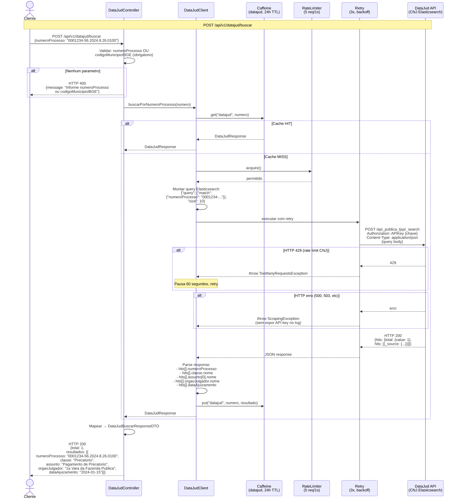

# Consulta DataJud — API CNJ

Fluxo de consulta a API publica do DataJud (Elasticsearch do CNJ) para enriquecimento de metadados processuais.

```mermaid
sequenceDiagram
    actor Cliente
    participant Controller as DataJudController
    participant Client as DataJudClient
    participant Cache as Caffeine<br/>(datajud, 24h TTL)
    participant RateLimit as RateLimiter<br/>(5 req/1s)
    participant Retry as Retry<br/>(3x, backoff)
    participant DataJud as DataJud API<br/>(CNJ Elasticsearch)

    Note over Cliente,DataJud: POST /api/v1/datajud/buscar

    Cliente->>Controller: POST /api/v1/datajud/buscar<br/>{numeroProcesso: "0001234-56.2024.8.26.0100"}

    Controller->>Controller: Validar: numeroProcesso OU<br/>codigoMunicipioIBGE (obrigatorio)

    alt Nenhum parametro
        Controller-->>Cliente: HTTP 400<br/>{message: "Informe numeroProcesso<br/>ou codigoMunicipioIBGE"}
    end

    Controller->>Client: buscarPorNumeroProcesso(numero)

    Client->>Cache: get("datajud", numero)

    alt Cache HIT
        Cache-->>Client: DataJudResponse
        Client-->>Controller: DataJudResponse
    else Cache MISS
        Client->>RateLimit: acquire()
        RateLimit-->>Client: permitido

        Client->>Client: Montar query Elasticsearch:<br/>{"query": {"match":<br/>{"numeroProcesso": "0001234-..."}},<br/>"size": 10}

        Client->>Retry: executar com retry
        Retry->>DataJud: POST /api_publica_tjsp/_search<br/>Authorization: APIKey {chave}<br/>Content-Type: application/json<br/>{query body}

        alt HTTP 429 (rate limit CNJ)
            DataJud-->>Retry: 429
            Retry-->>Client: throw TooManyRequestsException
            Note over Client: Pausa 60 segundos, retry
        end

        alt HTTP erro (500, 503, etc)
            DataJud-->>Retry: erro
            Retry-->>Client: throw ScrapingException<br/>(sem expor API key no log)
        end

        DataJud-->>Retry: HTTP 200<br/>{hits: {total: {value: 1},<br/>hits: [{_source: {...}}]}}
        Retry-->>Client: JSON response

        Client->>Client: Parse response:<br/>- hits[].numeroProcesso<br/>- hits[].classe.nome<br/>- hits[].assunto[0].nome<br/>- hits[].orgaoJulgador.nome<br/>- hits[].dataAjuizamento

        Client->>Cache: put("datajud", numero, resultado)
        Client-->>Controller: DataJudResponse
    end

    Controller->>Controller: Mapear → DataJudBuscarResponseDTO

    Controller-->>Cliente: HTTP 200<br/>{total: 1,<br/>resultados: [{<br/>numeroProcesso: "0001234-56.2024.8.26.0100",<br/>classe: "Precatorio",<br/>assunto: "Pagamento de Precatorio",<br/>orgaoJulgador: "1a Vara da Fazenda Publica",<br/>dataAjuizamento: "2024-01-15"}]}
```
