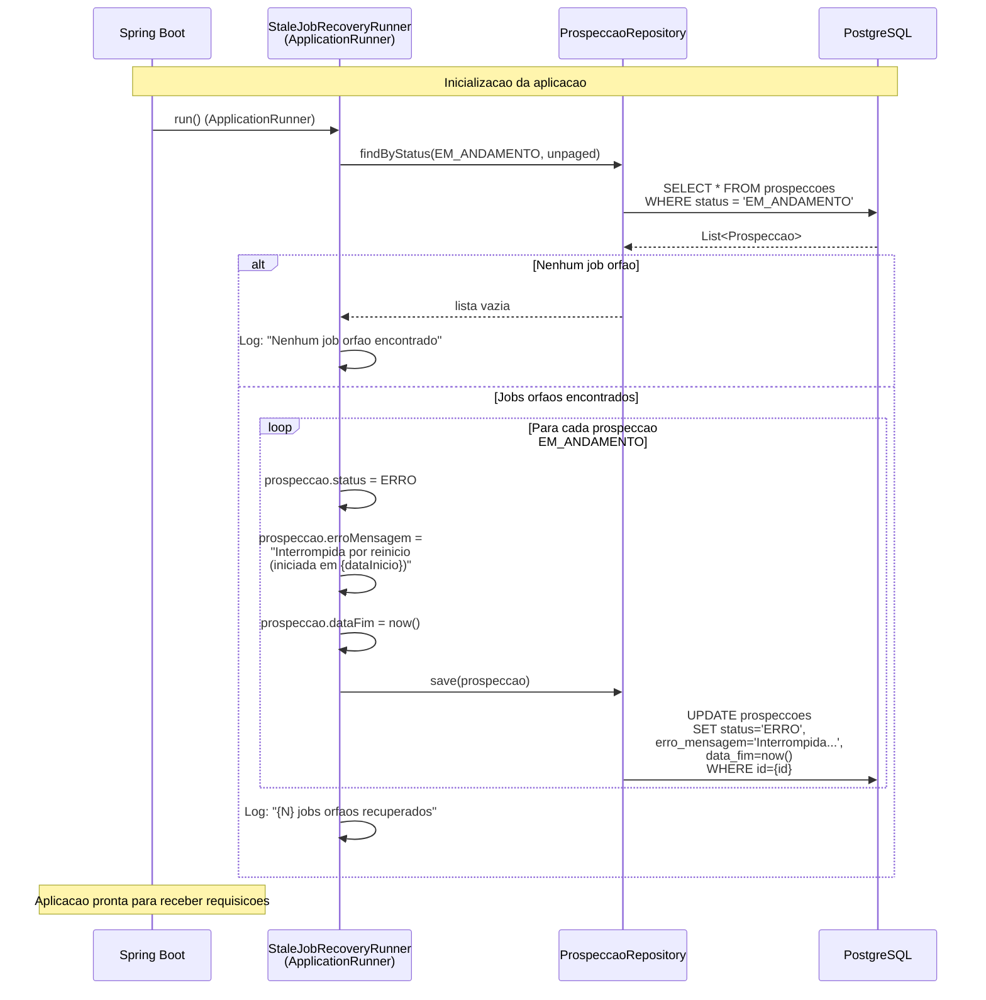
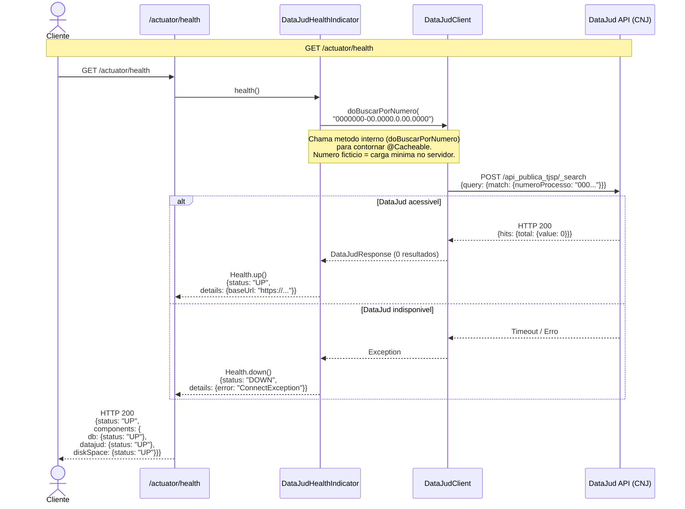

# Startup Recovery e Health Check

Fluxos operacionais: recuperacao de jobs orfaos na inicializacao e health check do DataJud.

## Recuperacao de Jobs na Inicializacao

```mermaid
sequenceDiagram
    participant Spring as Spring Boot
    participant Runner as StaleJobRecoveryRunner<br/>(ApplicationRunner)
    participant Repo as ProspeccaoRepository
    participant DB as PostgreSQL

    Note over Spring,DB: Inicializacao da aplicacao

    Spring->>Runner: run() (ApplicationRunner)

    Runner->>Repo: findByStatus(EM_ANDAMENTO, unpaged)
    Repo->>DB: SELECT * FROM prospeccoes<br/>WHERE status = 'EM_ANDAMENTO'
    DB-->>Repo: List<Prospeccao>

    alt Nenhum job orfao
        Repo-->>Runner: lista vazia
        Runner->>Runner: Log: "Nenhum job orfao encontrado"
    else Jobs orfaos encontrados
        loop Para cada prospeccao EM_ANDAMENTO
            Runner->>Runner: prospeccao.status = ERRO
            Runner->>Runner: prospeccao.erroMensagem =<br/>"Interrompida por reinicio<br/>(iniciada em {dataInicio})"
            Runner->>Runner: prospeccao.dataFim = now()
            Runner->>Repo: save(prospeccao)
            Repo->>DB: UPDATE prospeccoes<br/>SET status='ERRO',<br/>erro_mensagem='Interrompida...',<br/>data_fim=now()<br/>WHERE id={id}
        end

        Runner->>Runner: Log: "{N} jobs orfaos recuperados"
    end

    Note over Spring: Aplicacao pronta para receber requisicoes
```

## Health Check — DataJud

```mermaid
sequenceDiagram
    actor Cliente
    participant Actuator as /actuator/health
    participant Health as DataJudHealthIndicator
    participant Client as DataJudClient
    participant DataJud as DataJud API (CNJ)

    Note over Cliente,DataJud: GET /actuator/health

    Cliente->>Actuator: GET /actuator/health

    Actuator->>Health: health()

    Health->>Client: doBuscarPorNumero(<br/>"0000000-00.0000.0.00.0000")
    Note over Health,Client: Chama metodo interno (doBuscarPorNumero)<br/>para contornar @Cacheable.<br/>Numero ficticio = carga minima no servidor.

    Client->>DataJud: POST /api_publica_tjsp/_search<br/>{query: {match: {numeroProcesso: "000..."}}}

    alt DataJud acessivel
        DataJud-->>Client: HTTP 200<br/>{hits: {total: {value: 0}}}
        Client-->>Health: DataJudResponse (0 resultados)
        Health-->>Actuator: Health.up()<br/>{status: "UP",<br/>details: {baseUrl: "https://..."}}
    else DataJud indisponivel
        DataJud-->>Client: Timeout / Erro
        Client-->>Health: Exception
        Health-->>Actuator: Health.down()<br/>{status: "DOWN",<br/>details: {error: "ConnectException"}}
    end

    Actuator-->>Cliente: HTTP 200<br/>{status: "UP",<br/>components: {<br/>  db: {status: "UP"},<br/>  datajud: {status: "UP"},<br/>  diskSpace: {status: "UP"}}}
```
