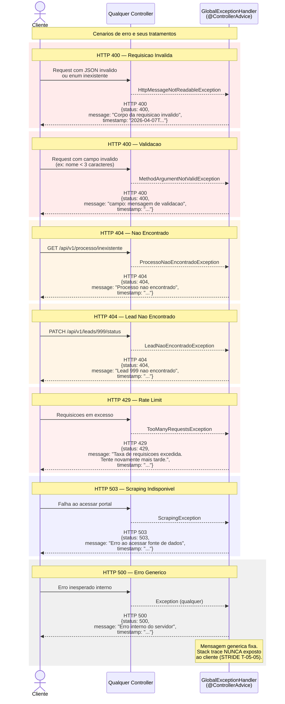

# Tratamento de Erros — GlobalExceptionHandler

Fluxo de tratamento centralizado de erros. Todas as excecoes sao capturadas pelo @ControllerAdvice e retornam respostas estruturadas sem expor stack traces.

